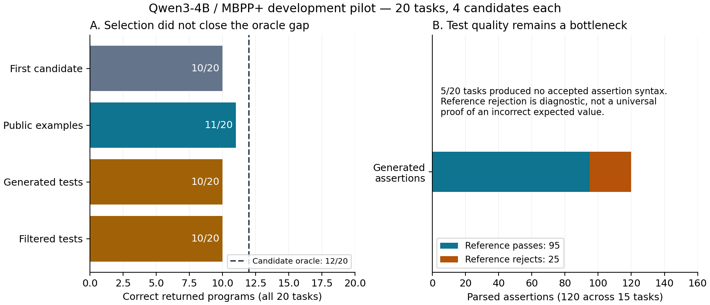

# Code Generation Verifier Study

**Status: frozen 180-task confirmation complete, 2026-09-12.** Conditional reasoning resampling reaches **118/180 (65.56%)**, versus **107/180 (59.44%)** for selected baseline and nonthinking resampling: **+6.11 percentage points, 11 rescues and zero observed regressions**. The prespecified exact paired test gives p=0.0009766; bootstrap 95% interval [2.78, 10.00] points. Both extension arms make 41 calls, with substantially different token costs. Small development routing, cap and prompt ablations are underpowered and inconclusive; no additional gain was established. See [report v0.9](reports/technical-report-v0.9.md) for matrices, costs and limitations.

**Research question:** when generated tests contain errors, what evidence is sufficient to select a code candidate—or decide that selection is unsupported—under a constrained compute budget?

This follows [Agreement is not confidence](https://github.com/WesleyJunweiSu/WesleyJunweiSu.github.io/blob/main/app/page.tsx). It is a replication and extension of established test-guided selection work, not a claim of a new state of the art.

## First results

Qwen3-4B BF16, non-thinking; MBPP+ v0.2.0; **20 development tasks × 4 candidates**. All selectors share a frozen candidate pool. Hidden tests are read only after selection decisions have been written.

| Method | Correct returned / all tasks | Coverage |
|---|---:|---:|
| First candidate | 10/20 | 100% |
| Public-example selection | 11/20 | 100% |
| Generated-test selection | 10/20 | 100% |
| Syntactically filtered tests | 10/20 | 100% |
| Fixed abstention heuristic | 0/20 | 0% |
| Candidate oracle, diagnostic only | 12/20 | — |

The first 120 parsed generated assertions included **25 reference rejections**. Five tasks produced comparisons without `assert`; an AST normalization ablation recovered 40 assertions, but generated-test selection remained at 10/20. Reference rejection requires specification review; it is not a universal proof of an invalid test. Thirteen tasks had four text-identical candidates. These are exploratory results, not evidence of general superiority or statistical equivalence.

The historical audit found **7/134 different labels** between the old Windows evaluator and Linux EvalPlus primitives. Historical test accuracy changed from 75/100 to 82/100 for exactly the same code; this is **not a model improvement**.



## Read and reproduce

- [Use this research project from Mac or iPhone through the Windows host](docs/remote-access.zh.md)
- [Project instructions for Codex on any device](AGENTS.md)
- [Technical report v0.8: completed confirmation and routing ablation](reports/technical-report-v0.8.md)
- [Technical report v0.7: transferred gain and final confirmation freeze](reports/technical-report-v0.7.md)
- [Final 180-task confirmation protocol](configs/confirmation-protocol.json)
- [Technical report v0.6: 40 additional tasks and public-trigger coverage](reports/technical-report-v0.6.md)
- [Technical report v0.5: public-failure routing, repair and reasoning controls](reports/technical-report-v0.5.md)
- [When the 180-task confirmation split can be used](docs/confirmation-readiness.md)
- [Technical report v0.4: temperature intervention and selection instability](reports/technical-report-v0.4.md)
- [Technical report v0.3: input-only consensus and adaptive composition](reports/technical-report-v0.3.md)
- [Technical report v0.2: evaluator mechanisms and test semantics](reports/technical-report-v0.2.md)
- [Initial pilot report v0.1](reports/technical-report-v0.1.md)
- [Experiment log](reports/experiment-log.md)
- [Checkpoint and next experiment](PROGRESS.md)
- [Research protocol](docs/pilot-protocol.md) and [frozen splits](configs/split-manifest.json)
- [Related work](docs/related-work.md) and [claim ledger](docs/claim-ledger.md)
- [中文面试讲解与简历表述](docs/interview-notes.zh.md)
- [Environment and source provenance](docs/provenance.md)

Analysis needs Python 3.12; plots additionally require Matplotlib. From the repository root:

```bash
python -m unittest discover -s tests -v
python scripts/analyze_results.py historical-holdout
python scripts/analyze_results.py mbpp-pilot-20260905
python scripts/analyze_results.py mbpp-parser-ablation-20260905
python scripts/analyze_legacy_diagnostics.py
python scripts/build_test_audit.py
python scripts/analyze_consensus.py
python scripts/analyze_composition.py
python scripts/selector_cli.py --task Mbpp/564 --method public_tests
python scripts/selector_cli.py --task Mbpp/564 --method filtered_abstain
```

The CLI displays saved decisions and code; it does not execute generated code. Linux execution uses the `Isolated Linux evaluator` GitHub Actions workflow or its restricted Docker invocation. Never execute generated candidates directly on a normal host.

The latest diagnostic reproduces queue-order false timeouts in two cases and an integer logging failure in one; two historical timeouts remain unresolved. The 34 reference-rejecting tests are provisionally annotated as 22 wrong expectations, 11 specification ambiguities/conflicts and one hidden-domain mismatch. These are AI-assisted analyst judgments, not independent human labels. Historical entropy metrics have been [recomputed without retuning](runs/historical-holdout/policy-reanalysis.json); a private blog correction draft is included.

**New development result:** input-only execution consensus returns 11/20, and unique-code voting returns 10/20. A public-first composition proposed after inspecting those outcomes returns 12/20, matching this pool's oracle. The adaptive 12/20 result is not independent confirmation. Its saved-evidence demo is `python scripts/selector_cli.py --run mbpp-public-consensus-20260906 --task Mbpp/607 --method public_then_consensus`.

**September 7 follow-up:** raising only temperature to 1.0 produces 32 distinct source programs versus 30, but the oracle remains 12/20. Fixed execution consensus falls to 10/20 and public-first consensus to 11/20. The initial composition gain is therefore not stable across these two generation conditions. See report v0.4 and `python scripts/compare_temperature.py` for the paired evidence.

To resume local generation using the existing environment:

```powershell
& 'C:/Users/Asuka/Documents/techblog/.venv/Scripts/python.exe' -u scripts/generate_batch.py --model-path 'C:/Users/Asuka/Documents/techblog/models/Qwen3-4B'
```

Recorded candidate keys are skipped. This resumes the pilot; it does not silently expand to confirmation data. Full model/tokenizer checksums are in `configs/model-fingerprint.json`. Weight files and hidden benchmark data are excluded from Git.

## Scope and limitations

This is a runnable research harness and evidence-inspection CLI, not a production coding assistant. The pilot has no demonstrated benefit from generated-test filtering or abstention. Full S* reproduction, calibrated operating points, independent seed repetitions, held-out confirmation and external data-science tasks remain unfinished. The temperature intervention used the same seeds on the same exposed tasks; it is not independent task confirmation.

Local hardware: RTX 5070 Ti Laptop, 12,227 MiB. The two model-generation phases took 352.5 seconds combined, excluding loading and other overhead; peak allocated VRAM was 8.08 GiB. The parser ablation reused all generations and added zero model tokens. No GPU rental or paid model API was used; Linux jobs use the account's GitHub Actions allowance.

## Completion audit and amended development scope

See [v0.9](reports/technical-report-v0.9.md): completed reasoning11 rescues/15 attempts, incomplete0/26. This is a post-hoc association, not a causal effect. Actual reasoning cost remains72,297 tokens (31.22x control);73.65% occurred in incomplete attempts. The completed-only8.22x ratio is not pipeline cost.

[Split v2](configs/split-manifest-v2.json) reassigns former calibration60 to development:120 total, primary100 plus legacy pilot20. Original confirmation180 and reserve78 are unchanged. [Next research design](docs/research-direction-v2.md) prioritizes completion-rate cap ablations and budget-matched independent sampling; these experiments have not run.
